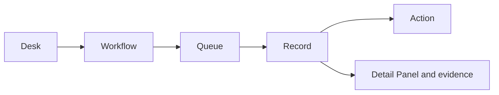

# Console tour

TokenBank Console is one operating surface with eight Desks. Each Desk contains workflows and Queues, each Queue lists Records, and a selected Record exposes valid Actions and a Detail Panel.

## Navigate safely

1. Confirm the active tenant and role.
2. Choose one of the eight live Desk routes.
3. Select the Queue that represents the current stage, not the desired result.
4. Open a Record and read status, Unit, owner, timestamps, and warnings.
5. Use only an Action whose preconditions you can verify.

The Console refreshes data periodically (currently about 30 seconds), so a list can lag briefly. Refresh or query the API before assuming an action failed.

## What actions mean

An Action may only change a decision, lock value, move value through a journal, trigger a scheduled workflow, or record external evidence. The confirmation summary and desk guide tell you which one applies.

## Verification

After an action, reopen the Record and compare status, balances/locks, journal reference, audit event, and any downstream Trade, Claim, Payable, or Statement.

## Troubleshooting

If a button is missing, check status and Capability. If a record is missing, check tenant, filters, Queue, and refresh time. If a financial result is unclear, stop before repeating the action.

## Boundaries

The retired routes `accounts-ledger`, `risk`, and `settlement` are not independent Desks. Their controls are integrated into current Desk records, references, and admin workflows.

Continue with the [first credit workflow](first-workflow.md), the [ledger model](../concepts/ledger-and-controls.md), or the [financial-flow selector](../guides/financial-flows.md).

## Search, pagination, and record controls

Catalog-enabled queues use server search and cursor pagination rather than filtering only loaded rows. The URL can retain `queue`, `q`, `scope`, `status`, `side`, `cursor`, and `snapshot`; available filters depend on the queue. Changing scope or filters starts a new first-page query.

The Workbench's 30-second refresh updates aggregates; it does not mean every catalog reloads every record. Check restricted `queue_scopes`, filters, and pagination before concluding there are no records. Loaded rows are not the total count.

Read the selected record's control message. Maker-checker prevents creators from approving their own records; some completion actions require an operator distinct from both requester and approver. Respect returned `can_approve`, `can_reject`, and `can_complete` flags. If another actor changed a record, reload its details and review again before submitting.
