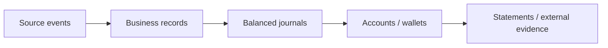

# Admin operations

Administrators keep business records, ledgers, automation, and external evidence consistent. Admin permission is not permission to bypass financial invariants.

## Daily checks

1. Review failed or overdue Scheduled Tasks and Alerts.
2. Inspect stalled approvals, locks, margin calls, settlements, claims, payables, and payout exceptions.
3. Reconcile Billing Wallet totals with purpose accounts and balanced journal lines by tenant and Unit.
4. Review unusual manual actions, reversals, policy changes, and cross-tenant access.
5. Check Checkpoints to ensure automation is advancing without skipping or duplicating source events.

## Manual recovery

First classify the failure: validation/policy, capability, insufficient value, idempotency conflict, scheduler failure, or external settlement uncertainty. Query existing evidence before retrying. Preserve the same business and idempotency identity. Use a supported retry or compensating reversal; never edit balances directly.

## High-risk actions

Write-off, forced cancellation, dispute release, policy override, payout confirmation, and manual repayment require a reason, source evidence, authorized role, and audit trail. Separate proposer and approver where possible.

## Reconciliation

## Verification

Record the incident or run identifier, affected tenant/Unit, evidence queried, exact recovery action, final balances and states, and approver. Confirm a second retry is a no-op.

## Troubleshooting

If a task repeatedly fails, stop blind retries and resolve its latest Alert. If external status is unknown, leave it pending/exceptional until the Provider confirms; do not mark paid to clear the Queue.

## Boundaries

Administration controls TokenBank state but cannot establish bank finality, legal ownership, or insurance liability. See [automation and settlement](../reference/automation-and-settlement.md).

## Check current controls before acting

Read the selected record's `control_message` and decision capabilities, and assign an eligible independent actor. Tenant Admin status alone does not authorize pool contributions or loan decisions; check platform capabilities and pool ownership. Review/settle SLA through Workflow tasks, using Cases for progress. Distinguish internal `financial_balance_reconciliation` from External Reconciliation evidence checks.
