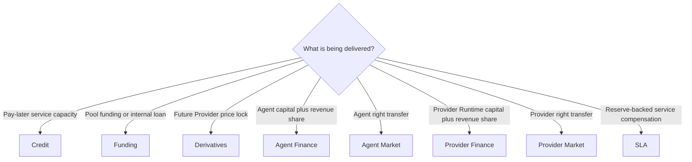

# Choose the right financial flow

Do not choose a Desk by the word “finance” alone. Choose it by value source and what the recipient receives.

## Decision table

| Source | Recipient gets | Desk |
| --- | --- | --- |
| Approved credit limit | permission to consume Nexus service before payment | Credit |
| Billing Wallet contribution | pool right; borrower receives internal funds | Funding |
| Buyer and seller margin | bilateral Forward exposure | Derivatives |
| Investor Billing Wallet | Agent revenue right | Agent Finance |
| Buyer locked Billing Wallet | transferred Agent right units | Agent Market |
| Investor Billing Wallet | Provider Runtime revenue right | Provider Finance |
| Buyer locked Billing Wallet | transferred Provider right units | Provider Market |
| Provider dedicated reserve | customer SLA compensation right | SLA |

Deep guides: [Credit](../desks/credit.md), [Funding](../desks/funding.md), [Derivatives](../desks/derivatives.md), [Agent Finance](../desks/agent-finance.md), [Agent Market](../desks/agent-market.md), [Provider Finance](../desks/provider-finance.md), and [SLA](../desks/sla.md).

## Verification

Before proceeding, state in one sentence where value comes from, where it goes, who can authorize it, what current status means, whether the next action moves value, and where success will be verified.

## Troubleshooting

If two Desks appear suitable, identify the delivered object. New capital plus future revenue share belongs in a Finance Desk; resale of an already registered right belongs in a Market Desk. Service compensation backed by one Provider plan reserve belongs in SLA.

## Boundaries

No flow here creates a bank deposit, public security, insurance policy, or guaranteed external cash payment.
