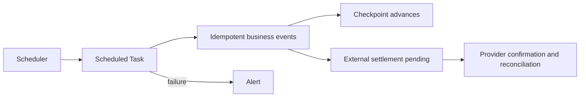

# Automation and external settlement

Scheduled automation advances overdue credit, lending, valuation, matching, revenue, SLA, and reconciliation workflows. It must be observable and idempotent.

## Core objects

| Object | Purpose |
| --- | --- |
| Scheduled Task | one runnable unit with status, attempts, and schedule |
| Checkpoint | last safely processed source position or time |
| Alert | operator-visible failure, risk, or inconsistency |
| External Settlement | evidence about a payment Provider or manual transfer outside TokenBank |

## Retry rules

Retry the same business event with the same identity. Advance a Checkpoint only after durable success. A partial external response stays pending or exceptional until reconciled. Closing an Alert does not change money by itself.

## External settlement states

Use explicit pending, confirmed, failed, and exception states. Store Provider reference, request/response timestamps, amount, Unit, counterparty, and reconciliation result. Never mark internal Payable as externally paid solely to clear a Queue.

## Verification

Check Task attempts, Checkpoint movement, created records/journals, Alert resolution, provider reference, and account/statement reconciliation. Run the task again and confirm no duplicate event appears.

## Troubleshooting

If a Checkpoint does not move, inspect the first failed source event. If it jumps, compare source ranges for omissions. If the Provider status is unknown, query/reconcile it rather than issuing a second payment.

## Boundaries

TokenBank can record external settlement evidence but cannot guarantee bank finality. Provider adapters and human operators remain responsible for trustworthy confirmation.

See [admin operations](../guides/admin-operations.md) for daily controls and [common troubleshooting](../troubleshooting/common.md) for failed tasks.

## Business cases versus scheduled tasks

SLA cases track `provider_monitoring → impact_calculation → claim_review → compensation_settlement → closed`. A Case connects an Incident to business progress; a Workflow Task identifies the resource requiring action at that stage. It is neither a Celery Task Run nor a generic task-claiming system.

Current `workflow-cases/` and `workflow-tasks/` endpoints expose GET lists. Review and settlement still use Claim product actions; the service advances tasks after success. Marking a task done cannot substitute for settlement.

Periodic scheduling uses Celery wrappers and Beat. The current Run-now API invokes the registered runner inside the request and returns its result; HTTP 201 does not universally mean queued but unexecuted. After a timeout, inspect the Run, Checkpoint, and business records before retrying. The `financial_balance_reconciliation` task reconciles internal balances, separately from external payment reconciliation.
