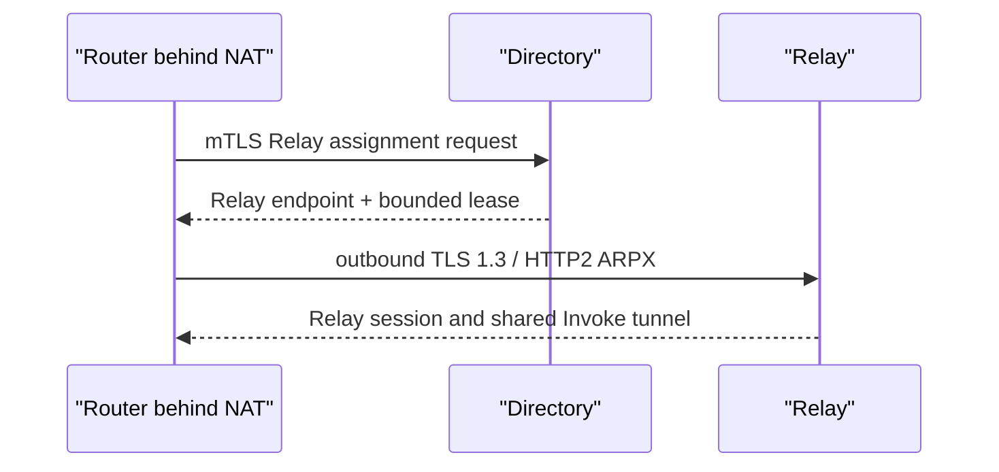

# Discovery, trust, and paths

Discovery answers “who might be reachable,” admission answers “may it become a Peer,” and route propagation answers “what capabilities does it offer.” Observe these stages separately.

## LAN DNS-SD

Routers publish and consume `_agent-router._tcp.local` records. Candidates contain bounded metadata such as Router ID, domain, endpoint, and lease time—not prompts, tokens, or Agent payloads.

The default is observation only. **Quick Setup → LAN admission** or **Advanced Settings → LAN discovery** can require manual approval, admit the same domain, use an allowlist, or admit all validated LAN Routers. Prefer manual, same-domain, or allowlist in production.

## DNSSEC SVCB

Cross-domain discovery queries `_agents.<domain>` SVCB records. The Router accepts results only when a local validating resolver provides authenticated DNSSEC data. The target, port, and `ipv4hint` remain candidate metadata; an address hint is not trust evidence.

SVCB finds a Router across administrative domains; it is not an Agent transport. Admit the candidate in **Peer Trust**, or authorize it through Agent Card / Directory trust policy.

## Directory and NAT Relay

A Node behind NAT makes a short mTLS request to Directory, receives a leased Relay assignment, and opens an outbound TLS 1.3 + HTTP/2 ARPX connection to that Relay. Directory assigns transport; it does not directly trust remote Agent routes.



```text
DNS-SD / SVCB candidate
        ↓ manual or policy admission
dynamic ARPX Peer
        ↓ leased remote capabilities
ARIB candidates
        ↓ identity policy, hard constraints, scoring
AFIB route
        ↓
Invoke
```

Revoking a Peer withdraws learned capabilities immediately or through controlled graceful expiry. An automatically admitted candidate can return on the next refresh, so also change the admission mode or allowlist.
