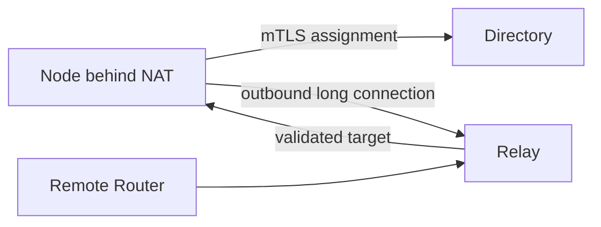

# Discovery, trust, peers, and Relay

Knowing where a Router is, choosing to establish a session, and authorizing its capabilities are three different decisions. Discovery deliberately does not become trust; otherwise any LAN advertiser could enter the capability routing table.

## LAN discovery produces candidates

Routers can advertise `_agent-router._tcp.local` through DNS-SD. Receivers build a bounded candidate table from `umdns`, validating TXT fields, source, and TTL. Candidates do not automatically become peers or ARIB/AFIB routes.

LuCI LAN admission chooses the next step: manual, same-domain, or allowlist. Automatic admission still requires identity, domain, and endpoint policy to match.

## What ARPX peers exchange

Trusted Routers use a mutual-TLS HTTP/2 ARPX session for OPEN, HEARTBEAT, capability UPDATE/WITHDRAW, and snapshots. Announcements carry boot epoch, sequence, remaining lease, path vector, metrics, and policy tags.

- sequence prevents old increments from replacing new state;
- remaining lease avoids trusting a remote monotonic timestamp;
- path vector and split horizon prevent loops;
- snapshot reconciles missing routes after reconnect;
- stale/graceful timeout tolerates a short break without keeping old routes forever.

## Reflector trade-offs

A full mesh requires every Router to connect to every other Router. A reflector reduces sessions by re-advertising routes, at the cost of another dependency and path hop. Direct and reflector roles therefore coexist, with loop and hop checks on reflected routes.

## Directory and Relay cross NAT

A Node behind NAT can request a leased Relay assignment from a Directory using mutual TLS, then establish its own outbound ARPX/HTTP2 tunnel.

The Directory answers where to connect. The Relay carries constrained control and invoke traffic. The Node still owns capability and policy state. Assignments expire or can be revoked.

## Trust remains layered

Mutual TLS proves possession of a trusted certificate. Router/Directory trust decides whether control information is accepted. Policy RIB decides whether one tenant/source/intent call is allowed. Agent Card trust validates card identity. Passing one layer does not replace the others.

Choose LAN discovery plus admission for small LANs, static direct peers for fixed sites, a reflector for hub-and-spoke scale, and Directory plus Relay for NAT or Internet paths.

See [Router roles](../guides/router-roles.md) and the [two-router tutorial](../tutorials/two-router.md).
